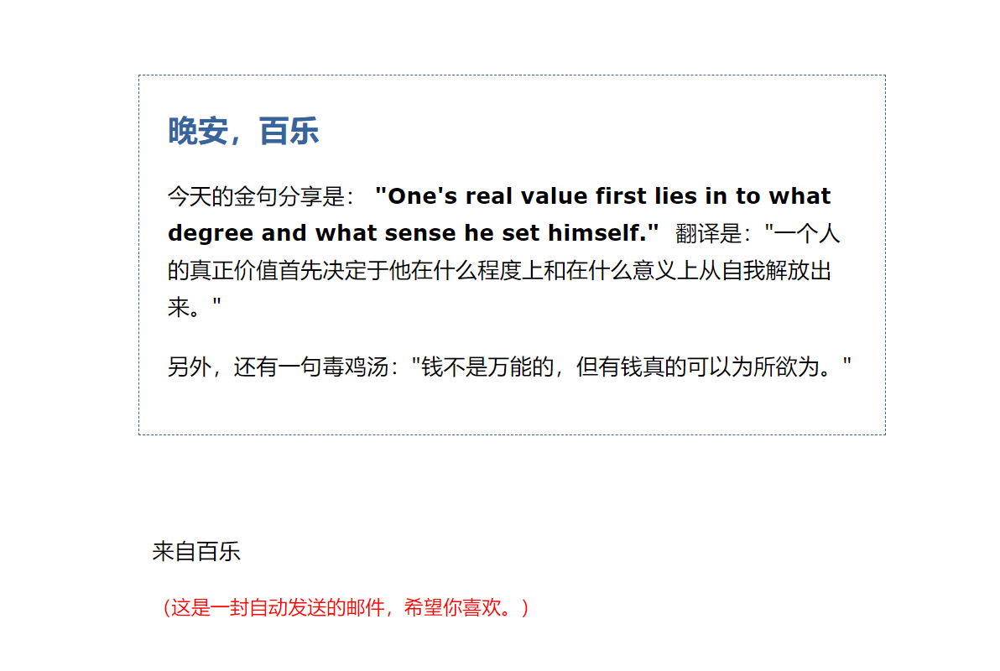

# 使用腾讯云函数，每日自动爬取英文鸡汤和毒鸡汤温馨晚安问候

### 效果图：

### 使用方法

* 在qq邮箱里打开smtp

* 修改配置文件config.py，包括`my_pass`，`my_sender`，`my_user`

* `新建云函数`->`自定义创建`->`python3.6`->`上传文件夹`
* `函数管理`里面，`执行超时时间`改为20秒以上，`重试次数`为1次
* 触发器，可以使用这个`0 30 23 * * * *`；每天晚上11:30发送一次

### 欢迎给我pull request添加新功能哟

* 美化发送页面（html页面
* 爬虫获取高清美图并嵌入html页面里

